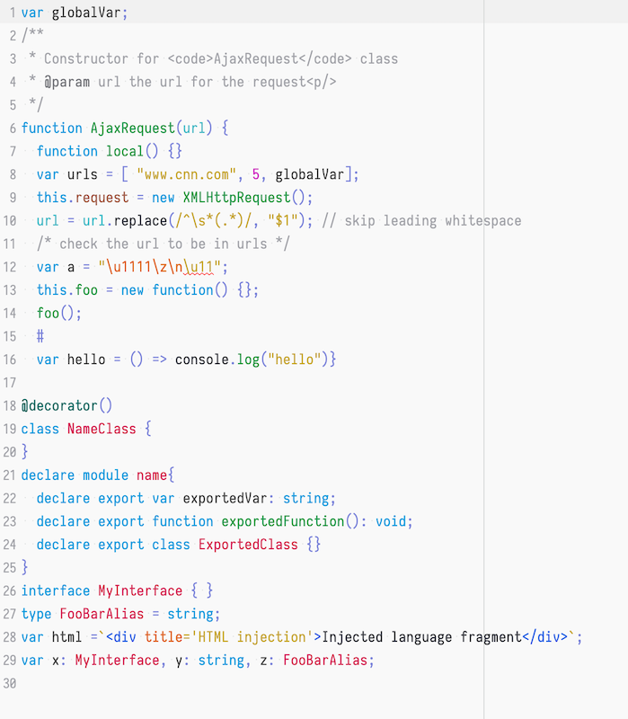

webstorm-bluloco-scheme
=======================

The bluloco color scheme for Jetbrains' Webstorm IDE (and other Jetbrains IDEs)

This scheme / theme supports all built-in languages in Webstorm.

## Screenshots:

The used font here is [Iosevka](https://github.com/be5invis/Iosevka).

### Dark

### Light

## Installation

You need to open `Preferences > Editor > Color Scheme` and click on the little cog icon and select `Import Scheme`

Like so:

Import both `Bluloco Dark.icls` and `Bluloco Light.icls` files here.

## Atom Editor
I also added the dark and light variant to the atom editor.
Check them out, too!  
https://atom.io/themes/bluloco-dark-syntax  
https://atom.io/themes/bluloco-light-syntax

## Visual Studio Code / Sublime / TextMate
You can find the tmTheme Variant in the following repositories  
https://github.com/uloco/theme-bluloco-light  
https://github.com/uloco/theme-bluloco-dark  

## Have fun! :)
